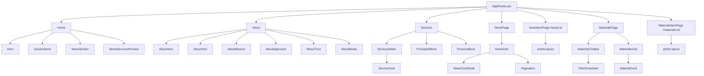
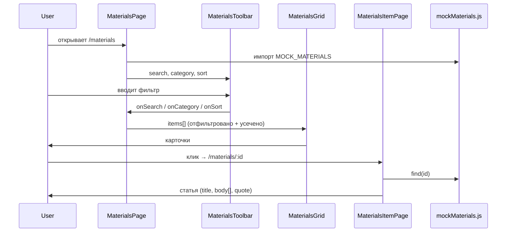
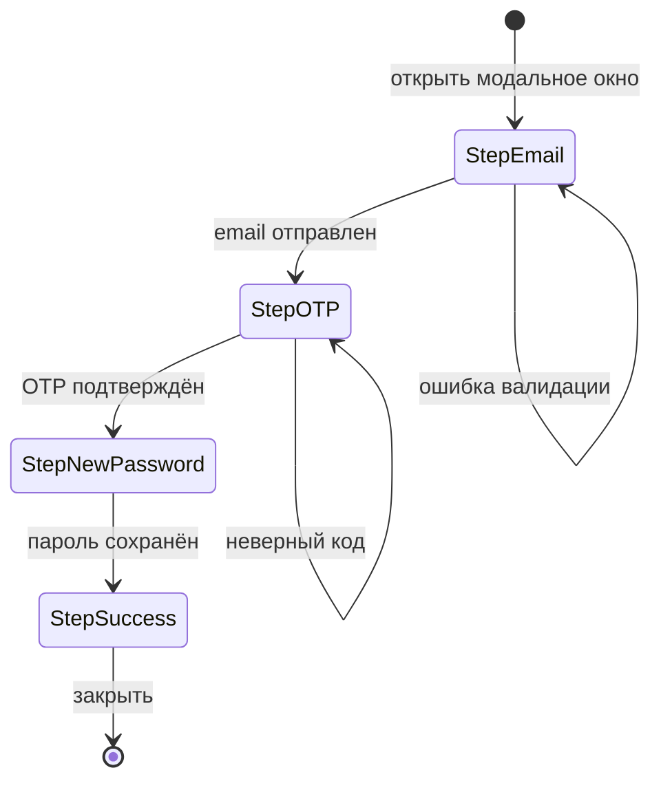

# Project Diagrams

## 1. Monorepo Overview

```
mindcare/
├── mindcare_web/   React 19 + CSS Modules   → :3000
└── mindcare_api/   Python FastAPI            → :8000
         ▲
         └── proxy: /api/* forwarded from :3000
```

---

## 2. Page → Component Map



---

## 3. Data Flow — Materials



---

## 4. Auth Flow — ForgotPassword



---

## 5. Component Hierarchy (text)

Shared components (`components/`) are reused across pages.  
Page-local components (`pages/<domain>/components/`) belong to one domain only.

```
Navbar                          ← shared
  └── AuthModal                 ← shared
        ├── LoginForm
        └── RegisterForm

Footer                          ← shared
PageHero                        ← shared (hero for all sub-pages)

─────────────────────────────────────────────────

pages/home/
  Home.jsx
  └── components/               ← page-local
        ├── Hero.jsx
        └── QuickActions.jsx
  (also uses shared: PageHero, NewsSection, Footer)

pages/about/
  About.jsx
  └── components/               ← page-local
        ├── AboutHero
        ├── AboutIntro
        ├── AboutMission
        ├── AboutServicesPreview
        ├── AboutApproach
        ├── AboutTrust
        └── AboutMedia

pages/services/
  Services.jsx
  └── components/               ← page-local
        ├── ServicesHero
        ├── ServicesSlider
        │     └── ServiceCard
        ├── PrinciplesBlock
        └── ProcessBlock

pages/news/
  NewsPage.jsx
  NewsItemPage.jsx
  └── components/               ← page-local
        ├── NewsGrid
        │     ├── FeaturedNews  ← shared (components/News/)
        │     └── NewsListItem  ← shared (components/News/)
        ├── Pagination
        └── mockNews.js

pages/materials/
  MaterialsPage.jsx
  MaterialsItemPage.jsx
  └── components/               ← page-local
        ├── MaterialsHero
        ├── MaterialsToolbar
        │     ├── search input
        │     ├── FilterDropdown (Категория)
        │     └── FilterDropdown (Сортировка)
        ├── MaterialsGrid
        │     └── MaterialCard[]  →  Link /materials/:id
        └── mockMaterials.js
```
