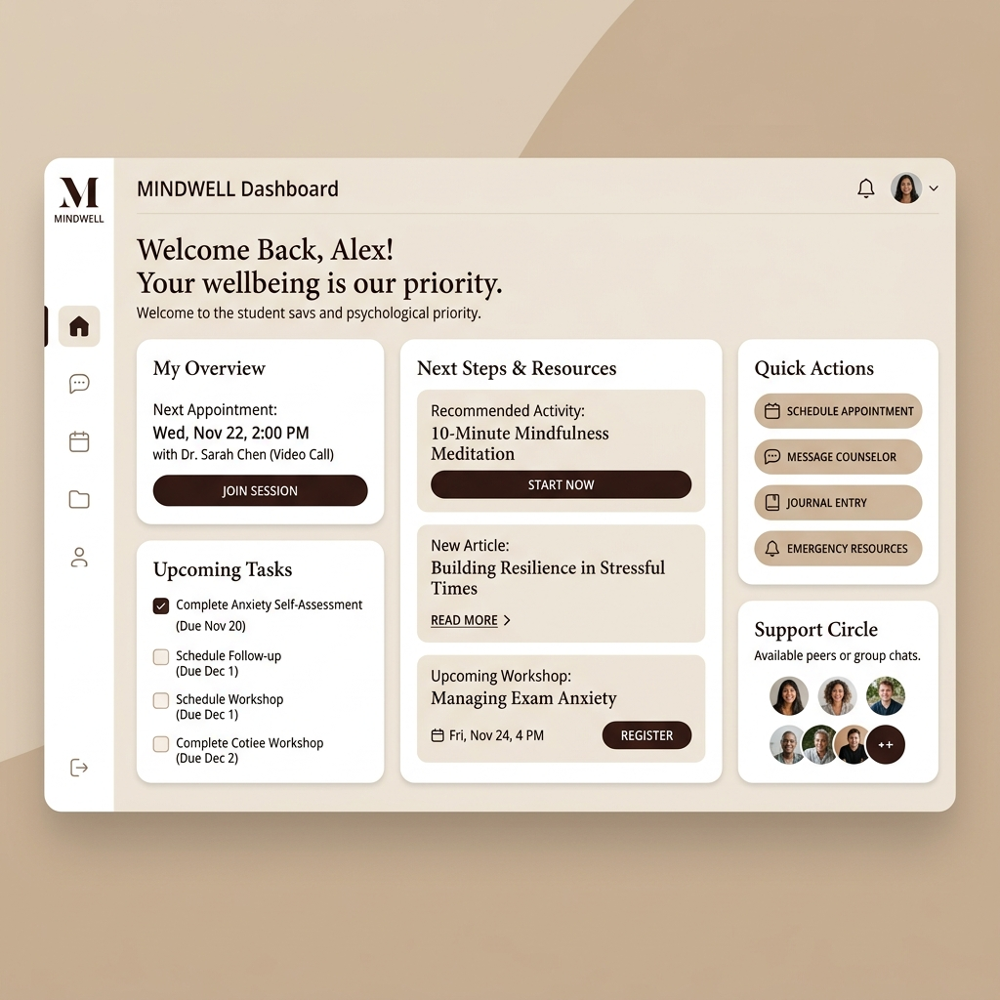
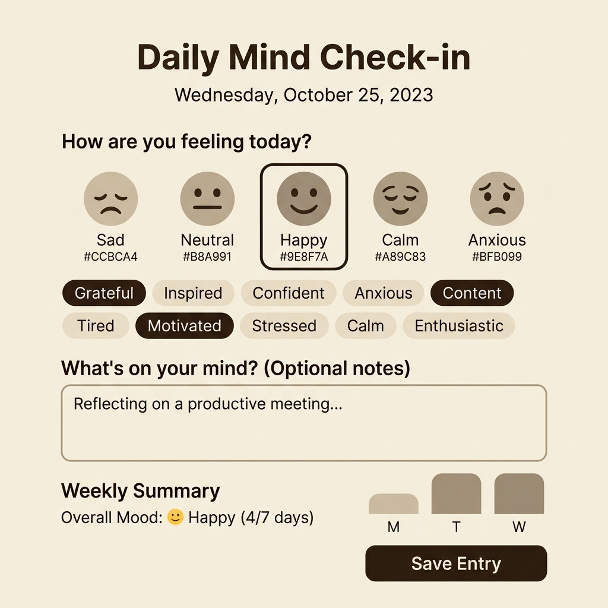
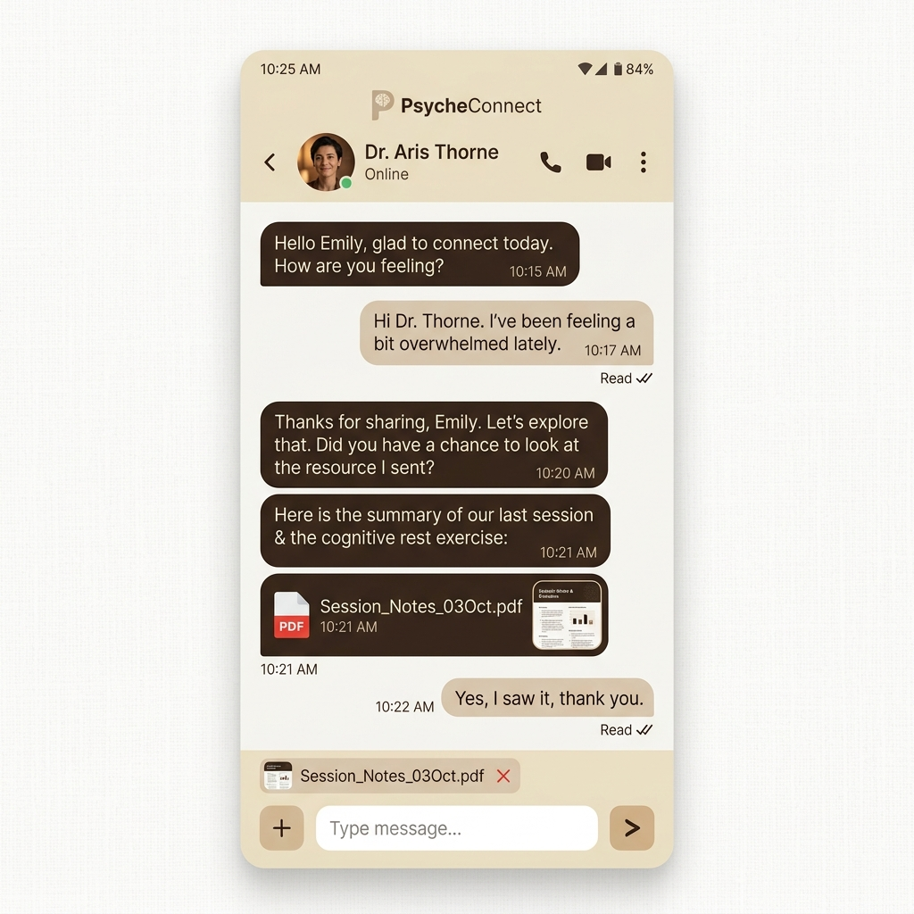

# Руководства пользователей платформы MindCare

Данный документ описывает доступный функционал для каждой из ролей в системе. Платформа предоставляет адаптивный интерфейс (с поддержкой мобильных устройств), который перестраивается в зависимости от вашей роли: **Студент**, **Психолог**, **Супервизор** или **Администратор**.

---

## 1. Роль: Студент (Student / Client)
**Цель:** Получение психологической поддержки, отслеживание своего состояния, запись на консультации и изучение материалов.

### 1.1. Главный кабинет (Dashboard)

- **Карточка следующего шага (`nextStepCard`)** — система автоматически подсказывает наиболее актуальное действие (например, пройти тест или заполнить дневник).
- **Быстрые действия** — удобные кнопки для быстрого перехода к материалам, записи или чату.

### 1.2. Дневник самонаблюдения (Diary)

- **Отметки состояния:** Ежедневный трекинг настроения с возможностью добавить текстовые заметки и теги эмоций.
- **История и сводка:** Просмотр своих записей за разные периоды (14 дней, месяц, год). Система показывает статистику заполняемости.
- **Управление записями:** Возможность редактировать или удалять свои отметки.
- **Будущие функции (в разработке):**
  - Расширенная аналитика и графики состояния (на основе UX-исследований).
  - Инструмент экспорта данных дневника по запросу пользователя.

### 1.3. Сообщения (Messenger)

- **Личный чат с психологом:** Безопасное пространство для общения один на один.
- **Вложения:** Поддержка отправки изображений, PDF, текстовых и Office-документов.
- **Предпросмотр (Lightbox):** Удобный просмотр изображений и PDF прямо в чате без необходимости скачивания.
- **Управление сообщениями:** Возможность редактировать и удалять отправленные сообщения.
- **Статусы и уведомления:** Индикация прочтения (✓/✓✓) и значок онлайна собеседника.
- **Системный чат («MindCare»):** Отдельный чат только для чтения, куда приходят автоматические уведомления.
- **Будущие функции (в разработке):**
  - Групповые чаты для участников групповой терапии (Group chat).
  - Предпросмотр в браузере для Office-документов.
  - Индикатор прогресса загрузки файлов.
  - Уведомления системы о назначенных заданиях и новых материалах прямо в системный чат.

### 1.4. Календарь и записи (Calendar)
*[Скриншот: Календарь со списком предстоящих встреч - скоро появится]*
- **Управление встречами:** Просмотр предстоящих и истории прошедших сессий.
- **Запись:** Возможность выбрать тип встречи, формат и свободный слот у закрепленного за вами психолога.

### 1.5. Материалы, тесты и группы
*[Скриншот: Каталог тестов и материалов - скоро появится]*
- **База знаний и Тесты:** Доступ к статьям и психологическим опросникам с сохранением истории.
- **Будущие функции (в разработке):**
  - Выделение клинических опросников (GAD-7, PHQ-9) в отдельный специализированный модуль тестирования.

---

## 2. Роль: Психолог (Psychologist)
**Цель:** Ведение клиентов, консультирование в чате, управление своим расписанием и сессиями.

### 2.1. Управление студентами (My Students)
*[Скриншот: Список закрепленных студентов и детальная карточка клиента - скоро появится]*
- **Список клиентов:** Просмотр всех закрепленных за вами студентов.
- **Карточка студента:** Просмотр истории встреч и результатов тестов.
- **Заметки к сессиям (Session Notes):** Ведение защищенных (зашифрованных) заметок по каждому клиенту, к которым нет доступа у других ролей.

### 2.2. Сообщения (Messenger)
- **Коммуникация:** Общение со своими клиентами (полностью аналогично студенческому интерфейсу: отправка файлов, предпросмотр документов, статусы прочтения).

### 2.3. Расписание и Встречи (Appointments)
*[Скриншот: Управление расписанием и слотами - скоро появится]*
- **Управление слотами:** Настройка своего рабочего времени и доступных слотов для записи.
- **Модерация встреч:** Просмотр заявок на индивидуальные и групповые сессии.
- **Будущие функции (в разработке):**
  - Автоматическая интеграция данных о прошедших сессиях с дневником студента.

---

## 3. Роль: Супервизор (Supervisor)
**Цель:** Организация работы центра, распределение нагрузки между психологами, контроль расписания.

### 3.1. Запись и распределение (Booking & Engagements)
*[Скриншот: Экран обработки новых заявок и форма назначения психолога - скоро появится]*
- **Новые заявки:** Обработка заявок от нераспределенных студентов.
- **Регистрация:** Регистрация профилей новых студентов.
- **Назначение психолога:** Распределение студентов по специалистам, создание связок «студент-психолог».
- **Будущие функции (в разработке):**
  - Ограничение доступа к заметкам сессий: супервизор будет видеть заметки только по закрепленным за ним кейсам.

### 3.2. Контроль расписания и услуги (Schedule & Service Cards)
*[Скриншот: Общее расписание и настройка услуг - скоро появится]*
- **Глобальное расписание:** Просмотр общего календаря всех специалистов центра.
- **Услуги:** Настройка типов предоставляемых консультаций (форматы, длительность).

---

## 4. Роль: Администратор (Admin)
**Цель:** Техническая поддержка платформы, управление пользователями и контентом, контроль аудита.

### 4.1. Управление пользователями
*[Скриншот: Таблица пользователей с формой редактирования профиля и смены роли - скоро появится]*
- **Редактирование профилей:** Управление данными и сброс паролей.
- **Смена роли:** Администратор может повышать права пользователей (например, назначить психолога). Требуется указание юридического основания (Legal Basis).
- **Будущие функции (в разработке):**
  - Интерфейс для просмотра истории юридических оснований (Legal basis records) прямо в карточке пользователя.

### 4.2. Аудит и безопасность
*[Скриншот: Доступ к журналам системы и логированию - скоро появится]*
- **Аудит:** Система ведет строгий учет действий (партиционированные таблицы логов), к которым у администратора есть доступ.
- **Будущие функции (в разработке):**
  - Аудит-лог для событий редактирования и удаления записей в дневниках студентов (Audit trail for diary edit/delete).
  - Transactional outbox для гарантированной доставки важных уведомлений (security/engagement).
