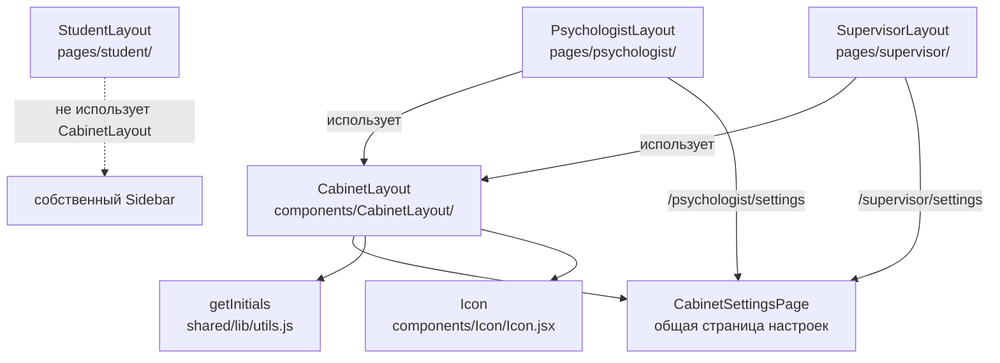
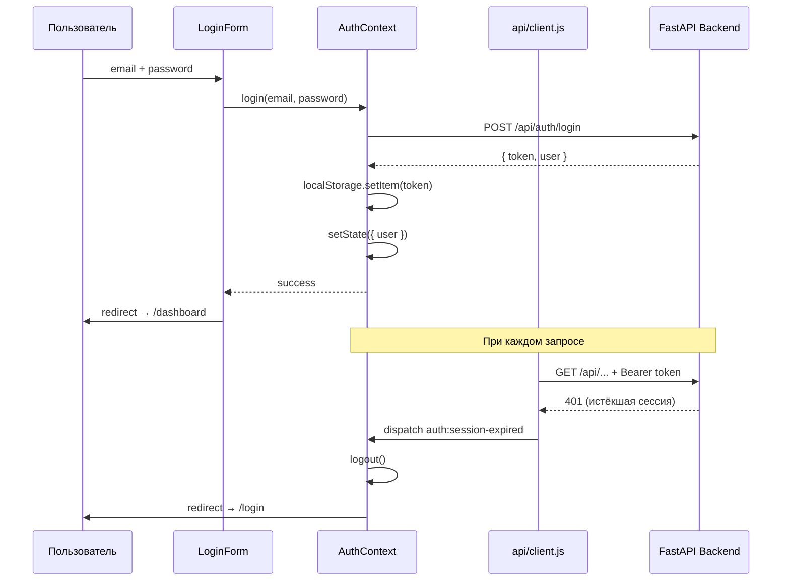
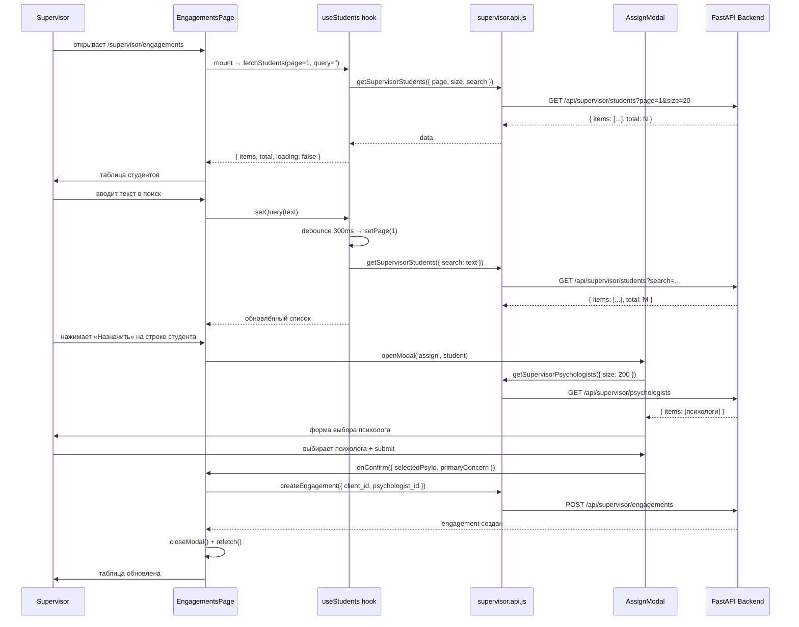
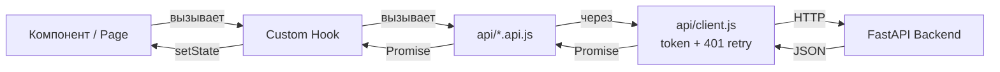
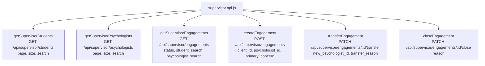

# MindCare Web — Frontend Diagrams

> Updated: 2026-06-08
> Все диаграммы описывают только frontend (`mindcare_web/src`).
> Backend — внешний API, взаимодействие через `api/client.js`.

---

## 1. Роли и маршруты

```mermaid
flowchart TD
    U([Пользователь]) --> PUB[Публичные страницы\n/ /about /services\n/news /materials]
    U --> LOGIN[/login /register]

    LOGIN --> AUTH{Аутентификация}

    AUTH -->|role: student| STU[/student/*]
    AUTH -->|role: psychologist| PSY[/psychologist/*]
    AUTH -->|role: supervisor| SUP[/supervisor/*]
    AUTH -->|role: admin| ADM[/admin/*]
    AUTH -->|любая роль| PROF[/profile]
    AUTH -->|редирект| DASH[/dashboard → DashboardRedirect]
    DASH --> STU
    DASH --> PSY
    DASH --> SUP
    DASH --> ADM

    STU --> STU1[/student — главная]
    STU --> STU2[/student/diary]
    STU --> STU3[/student/tests]
    STU --> STU4[/student/materials]
    STU --> STU5[/student/tasks]
    STU --> STU6[/student/chat]
    STU --> STU7[/student/calendar]
    STU --> STU8[/student/settings]

    PSY --> PSY1[/psychologist — главная]
    PSY --> PSY2[/psychologist/settings]

    SUP --> SUP1[/supervisor — главная]
    SUP --> SUP2[/supervisor/engagements ✅]
    SUP --> SUP3[/supervisor/settings]

    ADM --> ADM1[/admin/users]
    ADM --> ADM2[/admin/categories]
    ADM --> ADM3[/admin/tags]
    ADM --> ADM4[/admin/news]
    ADM --> ADM5[/admin/articles]
```

---

## 2. Структура frontend

```mermaid
graph TD
    SRC[src/]

    SRC --> APP[app/\nApp.jsx\nrouter.jsx\nproviders.jsx]
    SRC --> API[api/\nclient.js\nauth / users / tags\ncategories / news\narticles / materials\nsupervisor / media / health]
    SRC --> SHARED[shared/lib/\nutils.js\ngetInitials]
    SRC --> HOOKS[hooks/\nuseDebounce\nuseNews\nuseMaterials]
    SRC --> DATA[data/\n*.mock.js]

    SRC --> FEAT[features/]
    FEAT --> FAUTH[auth/\nAuthContext\nLoginForm\nRegisterForm\nForgotPassword]
    FEAT --> FSUPER[supervisor/\nhooks/useStudents\ncomponents/AssignModal]
    FEAT --> FADMIN[admin/\nAdminLayout\nusers / categories\ntags / news / articles]
    FEAT --> FPROFILE[profile/\nProfilePage]
    FEAT --> FNEWS[news/\nNewsSection\nFeaturedNews]

    SRC --> COMP[components/]
    COMP --> ICON[Icon/\nIcon.jsx]
    COMP --> CAB[CabinetLayout/\nCabinetLayout.jsx\nCabinetSettingsPage.jsx]
    COMP --> MODAL[Modal/\nModal.jsx]
    COMP --> UI[UI/\nMultiSelect\nTiptapEditor\nImageUpload\nContentPreview]
    COMP --> NAV[Navbar / Footer\nHero / CookieBanner]

    SRC --> PAGES[pages/]
    PAGES --> PPUB[Публичные\nhome / about / services\nnews / materials]
    PAGES --> PSTUD[student/\nStudentLayout\nStudentHome\nDiary / Tests\nMaterials / Tasks\nChat / Calendar\nSettings]
    PAGES --> PPSY[psychologist/\nPsychologistLayout\nPsychologistHome]
    PAGES --> PSUP[supervisor/\nSupervisorLayout\nSupervisorHome\nEngagementsPage]
    PAGES --> PCLIENT[client/\nClientDashboard\nОутер-обёртка /student]
```



---

## 3. Layout-архитектура кабинетов



---

## 4. Auth flow



---

## 5. Supervisor engagements frontend flow



---

## 6. Data flow (общий)



---

## 7. Supervisor API functions (frontend)


